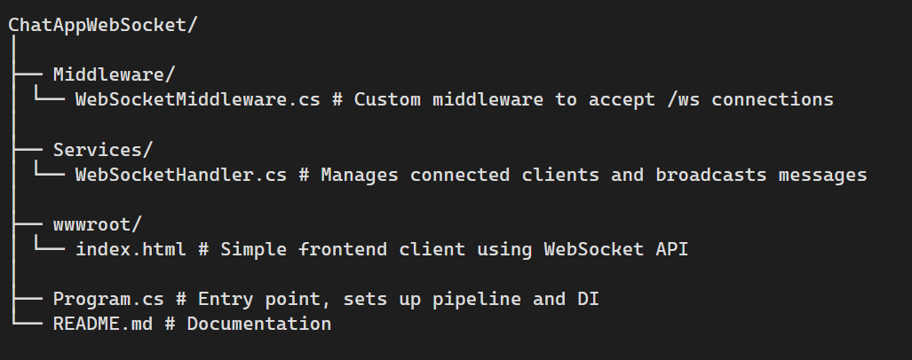

# 📨 ChatAppWebSocket (Raw WebSocket in ASP.NET Core)

This is a simple **chat application** built with **ASP.NET Core** using **raw WebSockets** (not SignalR).  
It demonstrates how WebSockets work under the hood for **real-time communication**.

---

## 📂 Project Structure



---

## ⚙️ How It Works (Flow)

1. **Client connects**
   - Browser loads `index.html`.
   - JS calls `new WebSocket("ws://localhost:5000/ws")`.

2. **Server upgrades**
   - Request hits `WebSocketMiddleware`.
   - If `Path == "/ws"`, server accepts and upgrades HTTP → WebSocket.

3. **Handler manages connection**
   - `WebSocketHandler` stores this connection in a shared list.
   - Starts a loop waiting for messages.

4. **Client sends a message**
   - Message arrives as **raw bytes**.
   - Server decodes bytes → UTF-8 string.

5. **Broadcast**
   - Server iterates over all open sockets.
   - Sends the message back to everyone (including sender).

6. **Close**
   - If a client disconnects, handler removes it from the list.
   - Closes connection gracefully.

---

## 🔑 Key Concepts of WebSockets (Interview Notes)

### 🔹 What is WebSocket?
- A **full-duplex communication protocol** over a single TCP connection.  
- Unlike HTTP (request/response), WebSocket allows **server ↔ client** to send messages **anytime**.

---

### 🔹 Why not just use HTTP/REST?
- HTTP is **stateless** and always **client-initiated**.  
- If you need real-time updates, you’d need **polling/long-polling**, which is inefficient.  
- WebSocket keeps one **persistent connection**, so server can push data instantly.

---

### 🔹 How does the handshake work?
1. Client sends an HTTP `GET` request with header:


GET /ws HTTP/1.1
Upgrade: websocket
Connection: Upgrade

2. Server replies with `101 Switching Protocols`.  
3. Connection is now upgraded to WebSocket.  
4. Both sides can send/receive freely.

---

### 🔹 Data Frames
- WebSocket messages are split into **frames**.  
- Each frame can be **Text** (UTF-8), **Binary**, or **Control** (Ping, Pong, Close).  
- In .NET:
- `result.MessageType` tells you if it’s text or binary.  
- `result.EndOfMessage` tells if this frame finishes the message.

---

### 🔹 Buffer & Encoding
- WebSocket APIs deal with **raw bytes**.  
- That’s why we use:
- `byte[] buffer` → to receive data.  
- `Encoding.UTF8.GetString(bytes)` → to decode to text.  
- `Encoding.UTF8.GetBytes(string)` → to send text.

---

### 🔹 Lifecycle of a WebSocket Connection
1. **Open** → Client connects, handshake successful.  
2. **Message** → Both sides exchange data frames.  
3. **Ping/Pong** → Keepalive frames to check connection health.  
4. **Close** → Either side requests close with a status code.

---

### 🔹 WebSocket vs SignalR
- **WebSocket**: Low-level protocol. You handle connections, messages, encoding.  
- **SignalR**: High-level abstraction in ASP.NET Core. Handles reconnection, scaling, message routing, multiple transports (WebSocket, SSE, Long Polling).  
- Interview tip: *“For simple chat demos I used raw WebSockets. In production with scaling, I’d prefer SignalR for its reliability and backplane support.”*

---

### 🔹 Common Interview Questions
1. What problem do WebSockets solve?  
→ Real-time, bidirectional communication without constant HTTP polling.

2. What is the difference between WebSocket and HTTP?  
→ HTTP is request/response. WebSocket is persistent, full-duplex.

3. How do you broadcast messages to multiple clients?  
→ Store active sockets in a list/dictionary, loop through and send.

4. What happens if a client disconnects suddenly?  
→ Server should detect closed connection (via `CloseStatus` or failed `SendAsync`) and remove it.

5. How do you secure WebSockets?  
→ Use `wss://` (WebSocket over TLS). Handle authentication (JWT/cookies) **before** upgrading.

6. What’s the role of buffer size?  
→ Determines max chunk size per `ReceiveAsync`. Larger messages may arrive in multiple frames.

---

## ▶️ Running Locally

1. Clone the repo:
```bash
git clone https://github.com/Akb98443/ChatAppWebSocket.git
cd ChatAppWebSocket

2. Open the project in Visual Studio.

3. Run the app (F5).
It will start on http://localhost:5000 (or another port Visual Studio assigns).

4. Open http://localhost:5000 in multiple browser tabs.

5. Type a message → it appears in all tabs instantly.
```